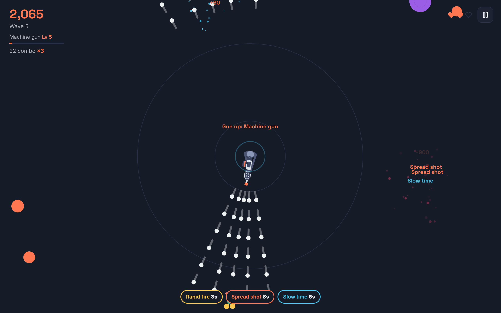
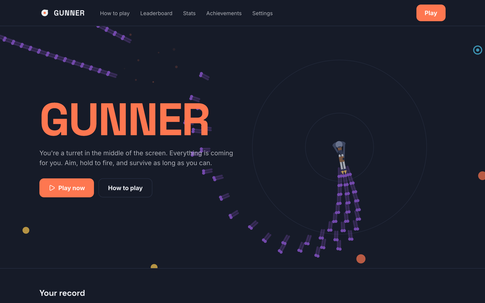
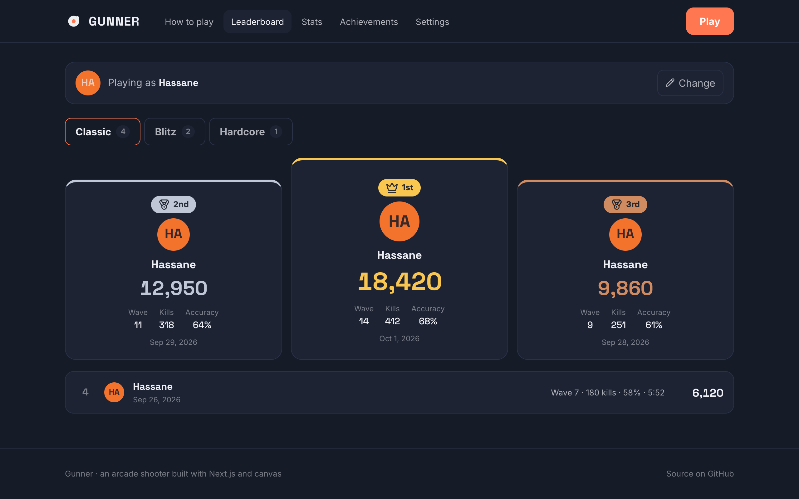
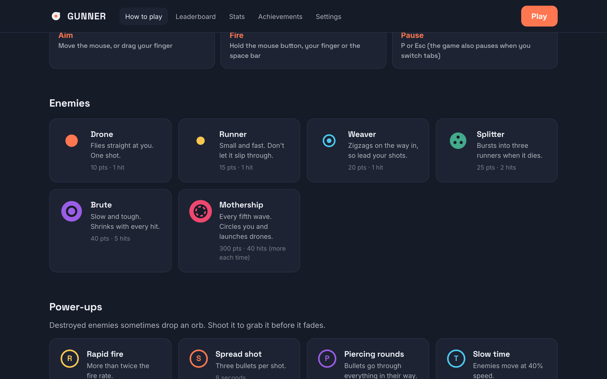
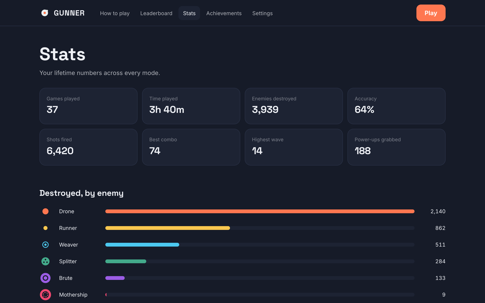

<div align="center">

# 🎯 Gunner

**An arcade shooter for the browser: you're the gunner in the middle of the screen and everything flies at you. Aim, hold to fire, upgrade your gun and survive as long as you can.**

[](https://nextjs.org)
[](https://react.dev)
[](https://www.typescriptlang.org)
[](https://developer.mozilla.org/docs/Web/API/Canvas_API)
[](https://developer.mozilla.org/docs/Web/API/Web_Audio_API)
[](https://sass-lang.com)
[](https://pnpm.io)
[](LICENSE)
<br />
[](https://github.com/boushib/gunner/commits/main)
[](https://github.com/boushib/gunner)
[](https://github.com/boushib/gunner)



</div>

## Screenshots

**Home:** the game plays itself in the background, with your best scores and the three modes



**Leaderboard:** your ten best games in each mode, with the top three on a podium



**How to play:** controls, the six guns, every enemy and power-up, and the scoring rules



**Stats:** games, time played, accuracy, best combo, highest wave and kills by enemy type



## About

I first built Gunner in 2022 as a single canvas script with Vite and GSAP: a white circle in the middle shooting at colored circles. In 2026 I rebuilt it on **Next.js 16** (App Router), **React 19** and **TypeScript**, with a new hand-written canvas engine, real gameplay (enemy types, waves, bosses, power-ups, gun upgrades) and a site around it.

It runs entirely on its own: no backend, no assets to download. Everything is drawn in code, the sound effects are synthesized with the Web Audio API, and scores, stats and achievements are saved in your browser.

## Features

### The game
- **Three modes:** Classic (endless waves, three lives, a boss every fifth wave), Blitz (90 seconds of nonstop enemies) and Hardcore (one life, faster enemies, double points)
- **Six guns:** every kill fills your gun bar, and a full bar upgrades your gun for the rest of the game, from a pistol to an SMG, a double barrel, an assault rifle, a machine gun and a minigun. Getting hit knocks it down a level
- **Six enemies:** drones, fast runners, zigzagging weavers, splitters that burst into runners, tough brutes that shrink as you hit them, and the Mothership boss, which circles you and launches drones
- **Seven power-ups**, dropped by enemies and collected by shooting them: rapid fire, spread shot, piercing rounds, slow time, shield, nuke and extra life
- **Scoring** with combos (up to ×5), wave-clear bonuses and perfect-wave bonuses
- Recoil, muzzle flashes, particles, screen shake, shockwaves that push enemies back, and floating points
- **Sound effects** synthesized with the Web Audio API
- Mouse, touch and keyboard: hold to fire, P or Esc to pause, and the game pauses when you switch tabs
- Frame-rate independent movement, sharp on high-DPI screens, and slower enemies on small screens so phones stay fair

### The site
- **Home** with the game playing itself in the background, your best scores and the three modes
- **How to play:** controls, the guns, every enemy and power-up, and the scoring rules
- **Leaderboard:** your top ten games per mode with a podium for the top three, under a generated username you can change
- **Stats:** lifetime numbers and kills by enemy type
- **Achievements:** 17 goals across all modes, announced on the results screen when you unlock them
- **Settings:** username, sound and volume, screen shake and particle amount, and clearing your data

### Design
- Flat colors on a dark navy background, Inter for text and Space Grotesk for headings and scores
- Responsive down to 320px, and playable with touch on phones and tablets

## Getting started

Requires Node.js 20.9+ and pnpm.

```bash
pnpm install
pnpm dev
```

Open [http://localhost:3000](http://localhost:3000). No environment variables are needed.

### Scripts

| Script | What it does |
| --- | --- |
| `pnpm dev` | Dev server |
| `pnpm build` / `pnpm start` | Production build and server |
| `pnpm lint` | ESLint (flat config) |
| `pnpm typecheck` | Route types and TypeScript, no emit |
| `pnpm dev:agent` / `pnpm build:agent` | The same on port 3500 with their own build folders, so a second server doesn't clash with yours |

In development the running game is available in the browser console as `window.gunner`.

## Project structure

```
app/(site)/           Home, how to play, leaderboard, stats, achievements and settings
app/play/             The full-screen game (?mode=classic | blitz | hardcore)
components/game/      The game screen: menu, HUD, pause and results
lib/game/engine.ts    The loop, spawning, combat, power-ups and gun levels
lib/game/draw.ts      Drawing enemies, bullets and effects
lib/game/guns.ts      The gunner and the six guns, seen from above
lib/game/config.ts    Enemies, power-ups, guns and modes
lib/save.ts           Settings, usernames, scores, lifetime stats and achievements, saved in localStorage
lib/sound.ts          Synthesized sound effects
```

## License

[MIT](LICENSE) © El Hassane Boushib
